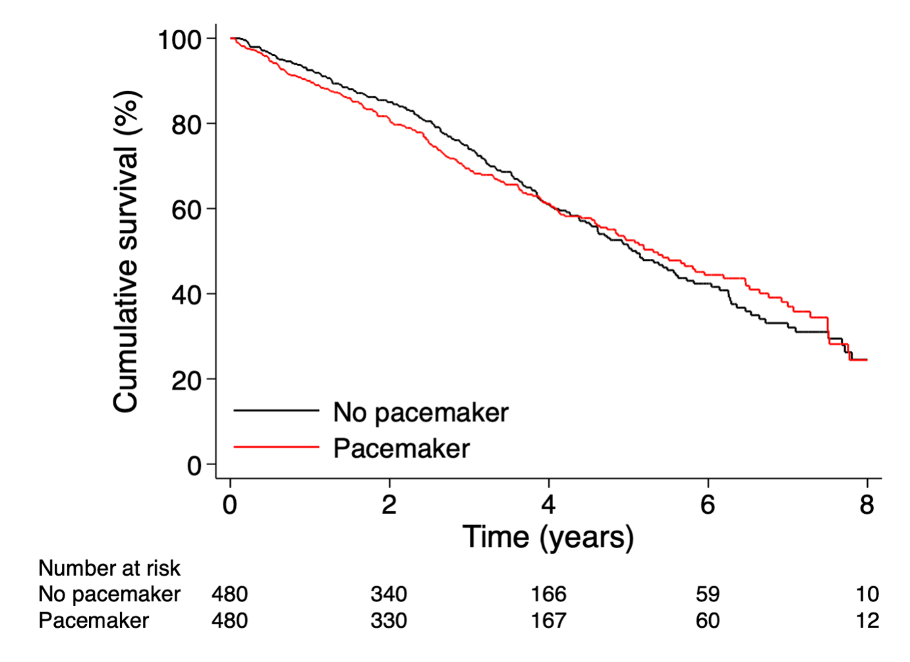

```{r setup, include=FALSE}
knitr::opts_chunk$set(echo = TRUE)
knitr::opts_chunk$set(message=FALSE, error=FALSE, warning=FALSE, comment=NA, echo = knitr::is_html_output())   
options(mc.cores = parallel::detectCores())   

# for pdf page breaks - insert`r pagebreak()`
pagebreak <- function() {
  if(knitr::is_latex_output())
    return("\\newpage")
  else
    return('<div style="page-break-before: always;" />')
}

```

```{r}
library("rprojroot")
library("rstanarm")
library("arm")
library("bayesplot")
library("rms")
library("survival")
library("survminer")
library("plotly")
library("here")
library("IPDfromKM")
library("tidyverse")
library("KMunicate")
               
theme_set(bayesplot::theme_default(base_family = "sans"))
savefigs <- TRUE

```

## Introduction

Recently, a nationwide Swedish, population-based cohort study found no statistically significant difference for the risk of cardiovascular death (hazard ratio (HR): 0.91; 95% CI: 0.71-1.18; P = 0.611) in patients who underwent permanent pacemaker implantation after transcatheter aortic valve replacement (TAVR) between 2008 and 2018[@RN5759]. Leading the authors to conclude that long-term survival between patients who did and did not undergo permanent pacemaker implantation after TAVR was not different. While the study included a large unselected sample of 3,420 TAVR patients, there are a number of reasons why it is of interest to query the strength of the evidence supporting their conclusion.
<br>    

First, their central Kaplan Meier curve shows survival curves crossing, raising the possibility of a time varying HR such that the proportional hazards assumptions underlying their analysis may not be valid. Second given this is an elderly population (mean age > 81), the performed comparative life time analysis with some patients followed up to 10 years may not be the most informative and clinically relevant. As eventually we all die and this analysis perhaps obscures some earlier clinically pertinent mortality differences among those receiving and not receiving pacemakers post TAVR. Thirdly, the same nationwide databases have examined the mortality impact of pacemaker implantation in a contemporary population of aortic stenosis patients undergoing surgical aortic valve replacement (SAVR)[@RN5758] and the inclusion of all or some of this additional evidence may be informative.
<br>    

A Bayesian analysis[@RN4985] which directly estimates the probability of increased mortality post pacemaker insertion and which allows the incorporation of past knowledge may be helpful in furthering our understanding of this data by presenting actionable probabilities.    
<br>

## Methods     

<br>

### Data source      

<br>

To gain approximate access to this dataset, we digitalized the reported Kaplan-Meier mortality curve[@RN5759]. This was operationalized by following the technique of Guyot[@RN5762], utilizing [WebPlotDigitalizer](https://apps.automeris.io/wpd/) and the R programming language[@R]. Specifically, this reconstruction of the individual patient data used the R package IPDfromKM[@IPDfromKM] thereby allowing secondary Bayesian survival analyses to be performed.
<br>    

### Outcome
<br>    

While the original publication examined several different outcomes, this analysis is limited to the main outcome of total mortality as that is the only outcome for which we can estimate Kaplan--Meier-derived individual patient data (IPD). Given that the median follow-up is 2.7 years, that the KM slopes appear to change beyond 4 years and that assessing the impact of pacemaker implantation seems clinically most relevant in this shorter time window, we prespecified a maximum 4 year follow-up

### Statistical analyses
<br>    

The Bayesian analyses were performed using the Stan programming language[@stan]. This was accessed by the high level inferface rstanarm[@rstanarm] package wrapper and the `stan_surv` function. Analyses were performed with 2 different priors, the built-in default non-informative normal prior (normal (0, 2.5) and an informative prior based on a previous study of the risk of pacemakers implantation in a population undergoing surgical aortic valve replacement (SAVR)[@RN5759]. All analyses were executed within the integrated development environment of RStudio and the statistcal ccode can be found on [Gitbub](https://github.com/brophyj/tavr_pace).
<br>   

## Results    

<br>

### Verifying individual data extraction     

<br>

```{r}
# load the complete digitalized KM datasets
load(here::here("data/final_IPD.RData"))
```

Quality assessment of our Kaplan--Meier-derived IPD data extraction was performed analytically by calculating the overall hazard ration and 95% CI and graphically by checking the derived Kaplan--Meier curves (Figure 1) with the previously published propensity matched KM curves (Original Supplemental Figure 2). Not only is the data extraction  judged to be adequate graphically but also numerically with a calculated HR = 0.98, 95% CI 0.84 -1.24 which compares favorably with the published value (HR: 1.03; 95% CI: 0.88-1.22).         

```{r fig.height= 5.5, fig.width=6}

fig1 <- ggsurvplot(
    fit = survfit(survival::Surv(time, event) ~ 1 + as.factor(group), data = final_IPD), 
    xlab = "Time (years)", 
    ylab = "Overall survival probability",
    title = "Figure 1 Reconstructed PS matched KM curves",
    conf.int = FALSE,
    xlim = c(0,8),
    ylim = c(0, 1),
    risk.table = TRUE,
    risk.table.col = "strata", # Risk table color by groups
    legend.labs = c("no pacemaker", "pacemaker"),    # Change legend labels
    risk.table.height = 0.3,
    legend.title = " ") 

# ggsave("output/fig1.png", dpi = 600) # only saves part of the graph, needs work

```


```{r}

# check with publication
# Fit Cox
cox <- survival::coxph(survival::Surv(time, event) ~ as.factor(group), data = final_IPD)
# summary <- summary(cox)

# data extraction seems ok as calculated HR 1.02, 95% CI .84 - 1.24
# published HR 1.03, 95%CI 0.88 - 1.22)

# diagnostics
cox.zph <- cox.zph(cox)  
#print(cox.zph)

# survminer::ggcoxzph(cox.zph)
# survminer::ggcoxdiagnostics(cox, type = "deviance", linear.predictions = FALSE)


```
     
<br>     

The difference in survival probabilities with the 95% CI is plotted in Figure 2. One of the concerns with the original analysis was the possibility of time varying proportional hazards which is again suggested in this Figure. However, statistical tests suggested the proportional hazards assumption was not violated (p = 0.12), although it bears mentioning that the power to detect violations with this sample size is limited[@Austin].   
<br>


### Standard survival analysis to 4 years

Even if the proportional hazards assumptions are not violated, clinically it is indicated to investigate the risks over a more restricted time window. In accordance also with the varying risks, we elected a priori to concentrate on a 4 year time window. Using this time frame, we extracted the individual data as described in Methods section above. The frequentist Cox proportional hazards model analysis for this more restricted data set results in a HR = 0.88, 95% CI 0.70 - 1.11, p = 0.27. While this remains statistically not significant, the point estimate has clearly moved towards a survival benefit in the no pacemaker group. Using this analysis to conclude that a pacemaker does not influence 4 year mortality risks making a type II error (absence of evidence is not evidence of absence). To further explore the data, we next performed a bayesian survival analysis.
<br>

```{r}
no_pace <- read.csv(here::here("data/jb_no_pace.csv"), header= TRUE) # I added labels time survival directly to csv files
pace <- read.csv(here::here("data/jb_pace.csv"), header= TRUE)

# looking at 4 year

np <- c(480,340,166) # number at risk for no_pace
p <- c(480,330,167) # number at risk for pace
t_risk <- c(0,2,4) # X axis tick labels

pre_pace <- IPDfromKM::preprocess(dat=pace,
                                  trisk=t_risk,
                                  nrisk=p,
                                  maxy=100)

pre_no_pace <- IPDfromKM::preprocess(dat=no_pace,
                                     trisk=t_risk,
                                     nrisk=np,
                                     maxy=100)

est_pace <- IPDfromKM::getIPD(prep=pre_pace,
                              armID=0, # treat = 0
                              tot.events=NULL)

est_no_pace <- IPDfromKM::getIPD(prep=pre_no_pace,
                                 armID=1, # treat = 1
                                 tot.events=NULL)

# summary(est_pace)
# summary(est_no_pace)

# plot(est_pace)
# plot(est_no_pace)

# Nice plot
# report <- IPDfromKM::survreport(ipd2=est_pace$IPD,
#                                ipd1=est_no_pace$IPD,
#                                arms=2,
#                                interval=3, # Only 3 time points
#                               s=c(0.50,0.75,0.95))

# small unecessary function to get HR and 95%CI
hr <- function(lhr,se) {
  hr <- exp(lhr)
  ci <- exp(lhr - c(1,-1)*1.96*se)
  out <- list(hr, ci)
  out
}

# Alternative analysis with another package
# First, we have to bind both data frames together
both = dplyr::bind_rows(est_pace$IPD, est_no_pace$IPD)

# Fit Cox for 4 year data
cox <- survival::coxph(survival::Surv(time, status) ~ treat, data = both)
# summary(cox)

# one graph method
# KM <- survival::survfit(survival::Surv(time, status) ~ 1 + treat, data = both)
# time_scale <- seq(from = 0, to = 4, by = 2)
# KMunicate::KMunicate(fit = KM, time_scale = time_scale)

#preferred method to plot KM extracted data for 4 year window

supp1 <- ggsurvplot(
    fit = survfit(survival::Surv(time, status) ~ 1 + as.factor(treat), data = both), 
    xlab = "Time (years", 
    ylab = "Overall survival probability",
    title = "Figure 3 Reconstructed PS matched\n KM curves (4 year follow-up)",
    conf.int = FALSE,
    xlim = c(0,8),
    ylim = c(0, 1),
    risk.table = TRUE,
    risk.table.col = "strata", # Risk table color by groups
    legend.labs = c("no pacemaker", "pacemaker"),    # Change legend labels
    legend.title = " ") 


```

### Bayesian surival analysis

Bayesian approaches to survival analysis can provide a number of benefits over the classical frequentist approach, including the ability to make direct
probability statements about parameters of interest (the risk of pacemaker implantation), and to incorporate prior knowledge. Using a vaguely non-informative prior the HR for the no pacemaker group is 0.93, 95% crdible interval (CrI 0.74 - 1.16). While the CrI approximates the previously calculated CI, it can now used to formulate direct probability statements. As shown in Figure 3, the absence of a pacemaker is compatible with a 74% probability of decreased mortality compared to those receiving a pacemaker.    
<br>    

Previously research using the same Swedish databases have examined the risk of a pacemaker in patients undergoing SAVR[@RN5759] and found an increased risk (HR 1.14; 95% CI, 1.01-1.29). This is equivalent to a protective HR 0.88 (sd 0.07) for the no pacemaker group. Given the similarities in the populations, everyone with aortic stenosis undergoing treatment in the same hospitals in the same treatment windows, it seems reasonable to use this information to represent our prior beliefs. With this informative prior the HR for the no pacemaker group is 0.89, 95% credible interval (CrI 0.79 - 1.00). Given this informative prior is consistent with the observed TAVR data, the slight leftward shift and narrowing of the 95% CrI of the posterior distribution compared to the posterior with a vaguely informative prior is to be expected (see Figure 4). Using this infprmative prior, it can be appreciated that the probability of increased mortality following a pacemaker post TAVR is 97%.          
Testing the robustness of this result, one may consider a more skeptical informative prior distribution that remains centered on the point estimate (HR 0.88) from the SAVR pacemaker study but now allows twice the variability  (sd 0.1). In this case, the posterior probability of increased 4 year mortality following a pacemaker insertion remains high at 93%.       
<br>     

```{r}
mod1 <- stan_surv(formula = Surv(time, status) ~ treat,
                  data = both,
                  chains  = 3,
                  cores = 4,
                  seed  = 123,
                  iter = 2000)

# print(mod1, digits = 2)

# mod1$stan_summary
# hr(-0.07764, .11467)

# prior_summary(mod1)

# plot(mod1)

# vague default prior

temp <- data.frame()

x <- rnorm(5000, mean = -0.0744, sd = 0.111)
temp <- as.data.frame(x)
temp <- temp[which(temp$x >-0.5 & temp$x <0.5),]
temp <- as.data.frame(x)
# pnorm(0, mean(temp$x), sd(temp$x))

fig3 <- ggplot(temp, aes(x)) +
  stat_function(fun = dnorm, args = c(mean = mean(x), sd = sd(x))) +
  stat_function(fun = dnorm, args = c(mean = mean(x), sd = sd(x)), xlim = c(-0.5,0.0), geom = "area", fill= "orange",alpha = 0.5) +
  annotate("text", label = "Yellow area = probability (74%)\n increased mortality with pacemaker", x = -0.49, y = 3, color = "black", hjust=0) +
  scale_x_continuous(name = "Log (HR)") +
  scale_y_continuous(name = "Density") +
  labs(title="Probability of outcomes following pacemaker ",
       subtitle = "Non-informative priors", caption="AUC = area under the curve\n     PDF = probability density function") +
  theme_classic()

ggsave("output/fig3 .png", dpi = 600)

#######################
# informative prior hr 1.14; 95% CI, 1.01-1.29  increase with pacemaker JAMA Open July 13 2021 
# expressed as reciprocal 0.88 se about 0.075 (sensitivity will increase to 0.1 -> prob = 0.92)

mod2 <- rstanarm::stan_surv(formula = Surv(time, status) ~ treat,
                            
                            prior = rstanarm::normal(log(0.88),0.07), # coefficient
                            #prior_intercept = ..., # Only for the Intercept
                            
                            data = both,
                            chains = 4,
                            cores = parallel::detectCores(),
                            seed = 123,
                            warmup = 2000,
                            iter = 4000)

# mod2$stan_summary

x <- rnorm(5000, mean = -0.11437, sd = 0.0630) # values from mod2
temp <- as.data.frame(x)
temp <- temp[which(temp$x >-0.4 & temp$x <0.5),]
temp <- as.data.frame(x)
# pnorm(0, mean(temp$x), sd(temp$x))

fig4 <- ggplot(temp, aes(x)) +
  stat_function(fun = dnorm, args = c(mean = mean(x), sd = sd(x))) +
  stat_function(fun = dnorm, args = c(mean = mean(x), sd = sd(x)), xlim = c(-0.5,0.0), geom = "area", fill= "orange",alpha = 0.5) +
  annotate("text", label = "Yellow area = probability (97%)\n increased mortality with pacemaker", x = -0.4, y = 3, color = "black", hjust=0) +
  scale_x_continuous(name = "Log (HR)") +
  scale_y_continuous(name = "Density") +
  labs(title="Probability of outcomes following pacemaker ",
       subtitle = "Fully informative prior (N(log(0.88),0.07)", caption="AUC = area under the curve\n     PDF = probability density function") +
  theme_classic()


ggsave("output/fig4.png", dpi = 600)

# skeptical informative prior with sd = sd * srqt(2) = 0.07 * sqrt(2) = 0.1
mod3 <- rstanarm::stan_surv(formula = Surv(time, status) ~ treat,
                            
                            prior = rstanarm::normal(log(0.88),0.1), # coefficient
                            #prior_intercept = ..., # Only for the Intercept
                            
                            data = both,
                            chains = 4,
                            cores = parallel::detectCores(),
                            seed = 123,
                            warmup = 2000,
                            iter = 4000)

# mod3$stan_summary

x <- rnorm(5000, mean = -0.10509, sd = 0.07354) # from mod3
temp <- as.data.frame(x)
temp <- temp[which(temp$x >-0.4 & temp$x <0.5),]
temp <- as.data.frame(x)
# pnorm(0, mean(temp$x), sd(temp$x))

fig5 <- ggplot(temp, aes(x)) +
  stat_function(fun = dnorm, args = c(mean = mean(x), sd = sd(x))) +
  stat_function(fun = dnorm, args = c(mean = mean(x), sd = sd(x)), xlim = c(-0.5,0.0), geom = "area", fill= "orange",alpha = 0.5) +
  annotate("text", label = "Yellow area = probability (93%)\n increased mortality with pacemaker", x = -0.4, y = 3, color = "black", hjust=0) +
  scale_x_continuous(name = "Log (HR)") +
  scale_y_continuous(name = "Density") +
  labs(title="Probability of outcomes following pacemaker ",
       subtitle = "Partially informative priors (N(log(0.88),0.1)", caption="AUC = area under the curve\n     PDF = probability density function") +
  theme_classic()

ggsave("output/fig5.png", dpi = 600)


```


## Discussion

In this reanalysis of a recent publication from the SWEDEHEART registry[@RN5759], we were able to reliably extract the individual patient data concerning TAVR mortality as a function of receiving or not a permanent cardiac pacemaker. As the original analysis used a 10 year follow-up window and as the hazard rates varied over time, we analyzed the risk associated with a cardiac pacemaker using a shorter 4 year window. This has the advantages of being a period when the hazard ratios appear constant as well as providing results in a more clinicially pertinent risk window. Certainly one could argue that examining relative risks at 10 years when mean entry age is 81 is of limited value, since most patients will be deceased by this time, independently of the presence or absence of a pacemaker following their TAVR. Our standard survival analysis using 4 year mortality as the outcome revealed an increased risk following pacemaker insertion (HR = 0.88, 95% CI 0.70 - 1.11) which not reach statistical significance (p = 0.27). However, the  goal of this re-analysis was not to evaluate statistical significnace but rather to estimate the probability of any increase in total mortality experienced by the pacemaker group.  The estimation of this parameter requires a formal Bayesian survival analysis.     
<br>     

The Bayesian analysis with a vaguely information prior revealed a 74% probability of increased mortality among TAVR patients requiring a pacemaker group compared those not requiring same. The probability of increased mortality is increased to 93 - 97% probability when partial of full prior knowledge about the risk of mortality with pacemakers in aortic stenosis patients undergoing SAVR is integrated in the decision calculus.     
<br>    

The results from this Bayesian reanalysis lead to questions about the original conclusion of "no difference in long-term survival between patients who did and did not undergo permanent pacemaker implantation after TAVR". By concentrating on parameter estimation rather than on null hypothesis statistical testing and by incorporating relevant background knowledge, this Bayesian analysis arguably leads to a more insightful assessment of the risks of pacemakers following TAVR. Using aggregate data from previous clinical trials, multiple publication have demonstrated the additional advantages of Bayesian re-analyses. The current publication suggests that similar benefits maybe observed when this approach is applied to individual patient data in the context of an observational research design.

`r pagebreak()` ## Figures

```{r}
fig1

```


** Figure 2 Plot showing the difference in survival probability across time **    

```{r}
# cat("Figure 2 Plot showing the difference in survival probability across time")
f <- rms::npsurv(survival::Surv(time, event) ~ group, data=final_IPD)
# Regular plot showing the difference in survival probability across time
fig2 <- rms::survdiffplot(f, time.inc=1, xlab = "Time (years)", fun=function(y) y)

```

`r pagebreak()`
**Figure 3**    


```{r}
# cat("Figure 3")
fig3
```

`r pagebreak()`
**Figure 4**        

```{r}
#cat("Figure 4")
fig4

```
`
`r pagebreak()`
**Figure 5**     


```{r}
#cat("Figure 5")
fig5
```

`r pagebreak()`
**Supplemental figure - Extracted KM curve from original publication**    



```{r cc, eval=FALSE, fig.align="center", fig.cap=c("Figure 2 - Published PS matched KM curves"), include=FALSE, out.width="100%"}


# supplemental figure

cat ("Supplemental figure - Extracted KM curve from original publication")
pdf("output/supp1.pdf")
supp1
dev.off()

fig1a <- 

# 

# save figures
pdf("output/fig1 .pdf")
fig1
dev.off()

pdf("output/fig3 .pdf")
fig3 
dev.off()

pdf("output/fig4 .pdf")
fig4
dev.off()

pdf("output/fig5 .pdf")
fig5
dev.off()


```

`r pagebreak()` ## References
